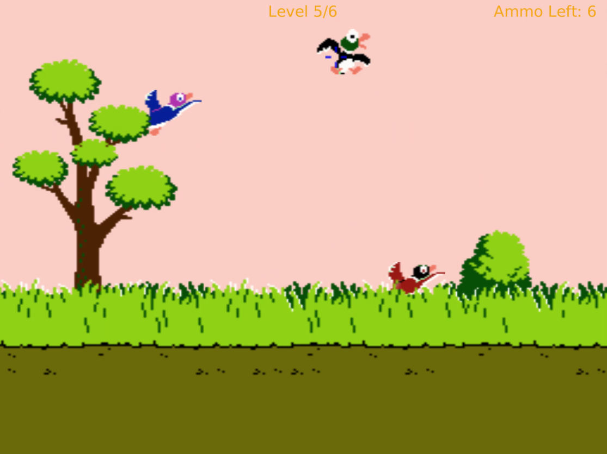

# DuckHunt Game

## Description
This is a classic DuckHunt game written in Java using JavaFX for the graphical interface.




## Getting Started
To compile the game, navigate to the src/ directory and run the following command:  
```bash
javac *.java
```
  

To run the game, use the following command:    
```bash
java DuckHunt
```


### Note
Make sure the `assets` folder is located within the `src` directory.

## Directory Structure

src/  
|_ assets/  
|_ DuckHunt.java  
|_ (other Java files)  

